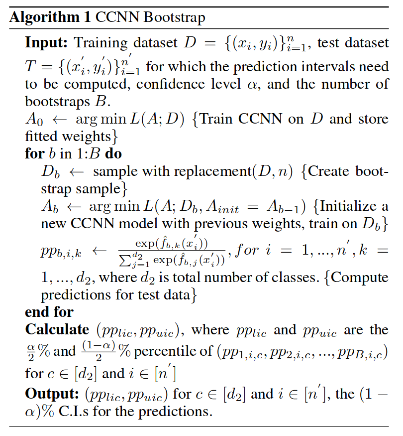

# Uncertainty Quantification in CNN Through the Bootstrap of Convex Neural Networks

This readme file is an outcome of the [CENG501 (Spring 2022)](https://ceng.metu.edu.tr/~skalkan/DL/) project for reproducing a paper without an implementation. See [CENG501 (Spring 2022) Project List](https://github.com/CENG501-Projects/CENG501-Spring2022) for a complete list of all paper reproduction projects.

# 1. Introduction

This work aims to reproduce the results of and further provide an alternative implementation for [Uncertainty Quantification in CNN Through the Bootstrap of Convex Neural Networks](https://ojs.aaai.org/index.php/AAAI/article/view/17434) by Hongfei Du, Emre Barut and Fang Jin [1].

## 1.1. Paper summary

Uncertainty quantification is an important task for almost any critical application that neural networks are in use. Despite that, the literature regarding it is freshly developing. There are many novel methods aiming to quantify uncertainty, however most of them do not have the theoretical guarantees regarding the quality of the quantification process. This [work](https://ojs.aaai.org/index.php/AAAI/article/view/17434) aims to provide a cheaper and theoretically supported alternative to novel Bayesian alternatives through prospoing a novel bootstrap based framework for the predictive uncertainty estimation. The inference procedure of the framework relies on convexified convolutional neural networks, [CCNNs](https://arxiv.org/abs/1609.01000) [2]. They further apply a "warm start" approach to boostrapping mechanism to reduce the number of sufficient iterations by a sizable amount. The authors finally propose a novel transfer learning approach to further increase the usability of their work.


# 2. The method and our interpretation

## 2.1. The original method

The method enjoys two nice properties coming from the CCNNs and warm-start bootstrapping:

* Firstly, the convexity of CCNNs both guarantee the statistical validity and theoretical background for the method and also the global optimum for the subsampled dataset.

* Secondly, the quantification process is quick since the method utilizes a warm-strat approach during bootstrapping, allowing it to initialize itself through the parameters of the previous solution.

The original method that the authors propose is summarized neatly on the following Figure 1:


<figcaption align="center">Figure 1 - CCNN Bootstrap Algorithm</figcaption>

Verbally, the method work as:

* First, train the network in order to have the weights for the first bootstrap sampling's warm-start
* Secondly, start the bootstrap sampling by initializing the model with previously saved parameters
* Then obtain some subset of dataset to train the network for that particular bootstrap
* After each sampling iteration, save the weights of the previous model for future use and save the predictions for statistics
* Finally, output the predictions of the model with their intervals

The authors further propose a novel transfer learning method, which is to utilize a backbone that was trained for a similar task before (e.g VGG16 pretrained on ImageNet) and add a CCNN layer right after the last convolutional layer of it. It is worth noting that if the backbone's training data somehow has intersections with the bootstrapped dataset, then the theoretical validity of this method would become invalid. In case of an inavailability of such pretrained networks, the authors further propose the following three techniques to obtain similar pretrained networks:
* Train & Forget: Start training a CNN on a certain dataset, after a certain number of epochs replace the dataset with another one, train until model outputs almost random guesses
* Train & Flip: Start training a CNN with the original labels of a dataset, then randomly flip labels at a certain time and continue training until the network overfits
* Train & Perturb: After training a CNN, add random perturbations to its weights


The authors choose the infamous [Deep Ensembles](https://proceedings.neurips.cc/paper/2017/file/9ef2ed4b7fd2c810847ffa5fa85bce38-Paper.pdf)[3] method and a shallow CNN, [LeNet-5](http://yann.lecun.com/exdb/publis/pdf/lecun-01a.pdf)[4] as baselines to compare their methods against. In order to do so, they consider the following metrics:

* Average length of the 95% confidence interval of the predictions of the model, shorter interval implying lower uncertainty
* Average log-likelihood, i.e. the average cross-entropy by each bootstrap sampling iteration, or more formally:
 $$ L = \frac{1}{B} \sum_{b=1}^B \sum_{i=1}^N H(p_i^b, y_i)$$
 where $H(;)$ is the cross-entropy function, $B$ stands for the number of bootstrap sampling iterations, $p^b_i$ stands for the probability output of the classifier for the given input and $y_i$ stands for the ground truth label.
 
## 2.2. Our interpretation 

We encountered the following problems understanding and implementing the methods and techniques that the authors utilized:
* We had some problems with the CCNN implementation. The design for it was done in 2017 and it was implemented without any framework support. (KIVANÇ BURAYA HER NE SORUN YAŞADIYSAN YAZ).
* Appendix for the paper wasn't available at the AAAI'21 conference archive, so we could not find the proof or the methods they specifically used for the theoretical basis of their transfer learning approaches.
* LeNet-5 that they provided was actually not the best in terms of its parameters (such as filters and kernel size) for the architecture.
* The average interval length was calculated as the average of interval lengths in the entire dataset, without considering interval length per each class.
* Number of samples to be obtained at each bootstrap sampling iteration was not specified.
* MNIST Blur and Cats&Dogs datasets caused us some problems while working on Google Colaboratory
* [Deep Ensembles](https://proceedings.neurips.cc/paper/2017/file/9ef2ed4b7fd2c810847ffa5fa85bce38-Paper.pdf)[3] method is rather expensive and it is really hard to run it from Google Colaboratory.
* Applying Gaussian noises to the weights of the model were rather difficult for us while implementing the Train & Perturb approach.
* Train & Forget method was also difficult to implement due to the CIFAR-10 dataset of PyTorch holding its targets as lists rather than numpy arrays, in contrast with the Fashion MNIST dataset.

We dealt with or skipped the aforementioned issues through the following assumptions and strategies:
* KIVANÇ BURAYA NE YAPTIYSAN YAZ CCNN İÇİN
* We decided to trust the authors while considering the theoretical background and validity of their transfer learning approaches.
* We additionally report results for another LeNet-5 architecture that we thought could produce better results.
* We took the average interval length calculation strategy just as the authors proposed, we do not calculate any classwise interval length whatsoever.
* Number of samples to be obtained at each bootstrap sampling was assumed as 200, since 100 felt a bit short of experimental performance expectations and more sampling made it rough for us to obtain the results in the plausible time interval.
* We could not reproduce the results for the MNIST Blur and Cats&Dogs dataset, we also do not report the results for [Deep Ensembles](https://proceedings.neurips.cc/paper/2017/file/9ef2ed4b7fd2c810847ffa5fa85bce38-Paper.pdf)[3], Train & Perturb and Train & Forget on Fashion MNIST (which was supposed to be pretrained on CIFAR-10).

# 3. Experiments and results

## 3.1. Experimental setup

The authors propose the following setups for the experiments for the aforementioned techniques that we are trying to reproduce (excluding the ones that we could not reproduce for stated reasons):
* CCNN KIVANÇ BURAYA YAZ ABİ NE KULLANDIYSA
* For bootstrapping, perform $B=100$ sampling iterations
* LeNet-5 with 3 convolution and 2 fully connected layers, where the numbers of convolution filters are (32,64,128) with a kernel size of (2,2).
* For train & forget, train a pretrained backbone for transfer learning through training the LeNet-5 on Fashion MNIST data (cats and dogs from CIFAR10) for 30 epochs. Then, training it with the same weights on Original MNIST data (deer and horse from CIFAR10) for another 30 epochs.
* For train & flip, train a pretrained backbone for transfer learning through training the LeNet-5 on Fashion MNIST data (cats and dogs from CIFAR10) for 30 epochs. Then, trainining it with the same weights on the same datasets with randomly flipped labels for another 30 epochs.
* Average interval length was obtained for 95% confidence during all experiments.


We have also followed the exact same settings, with the following additional assumptions and tools:
* PyTorch and Google Colaboratory was used as the experiment platform.
* Number of samples to be obtained at each bootstrap sampling was assumed as 200, learning rate was used as 5e-4 and batch size was used as 32.
* For the additional LeNet-5 that we report the results of, we used the number of convolution filters (6,16,120) with a kernel size of (5,5).


On top of these, following datasets were used:
* MNIST (LeCun et al. 1998)[http://yann.lecun.com/exdb/mnist/] with 10 classes of handwritten digits. The images’ size is 28x28 and in gray scale. There are 60,000 images for training and 1,000 images for testing. Used for obtaining the results of CCNN, LeNet-5 and LeNet-5 (from the paper) in accuracy, average log likelihood and average interval length metrics. It was also used as part of the train & forget approach's forget strategy.
* Fashion MNIST Dataset containing 10 classes of clothes (Xiao, Rasul, and Vollgraf 2017)[https://arxiv.org/abs/1708.07747]. The images’ size and sizes of training and testing datasets are same as above. Used for obtaining the results of CCNN, LeNet-5 and LeNet-5 (from the paper) in accuracy, average log likelihood and average interval length metrics. It was also used as part of the train & forget approach's train strategy and train & flip approach.
* CIFAR10 dataset (Krizhevsky et al. 2009)[https://www.cs.toronto.edu/~kriz/cifar.html] with 10 classes of different images. The images’ size is 32x32 and in rgb scale. There are 50000 training images and 10000 test images. Used for evaluating the performance of CCNN, Train & Forget and Train & Flip.
 


We have omitted <...> step in input normalization due to an issue...

## 3.2. Running the code

The implementation is split into directories:
* `bootstrap`: Contains functions for bootstrapping operations.
* `CCN`: Contains the implementation for the LeNet model used in the paper.
* `CCNN`: Contains the CCNN implementation and functions required by the CCNN. Largely adapted from
[Zhang et al.](https://github.com/zhangyuc/CCNN/blob/master/src/mnist/CCNN.py)

We have used Python 3.9 with the following packages to run the code:

* numexpr
* numpy
* pytorch
* scikit-learn
* torchvision

To install these packages with Conda, run

```conda create --name ccnn-bstrap-uq scikit-learn numpy numexpr```

Then install pytorch by using the desired command from [their website](https://pytorch.org/get-started/locally/).
We have used CUDA 10.2:

```conda install pytorch torchvision torchaudio cudatoolkit=10.2 -c pytorch```


If desired, our environment can be cloned using Conda and the `environment.yaml` file using the following command:

```conda env create -f environment.yaml```

To activate:

```conda activate ccnn-bstrap-uq```

Simply run `main/train_bootstrap.py` with the global `DATASET` variable set to the desired dataset to replicate our results presented in
[section 3.3](#33-results):

```python3 main/trainbootstrap.py```

## 3.3. Results


| Model \ Metric     | Accuracy      | Average Log Likelihood | Average Interval Length |
| ------------------ | ------------- | ---------------------- | ----------------------- |
| CCNN               | 97.4%         | -......                | -......                 |
| LeNet-5            | 96.29%        | -6.8776                | 0.0011                  |
| LeNet-5 (Paper)    | --.--%        | -......                | -......                 |

<figcaption align="center">Table 1 - Results of CCNN, LeNet-5 and LeNet-5 (from the paper) in Accuracy, Average Log Likelihood and Average Interval Length for MNIST Dataset</figcaption>

------------------------------------------------------------------------------------------

| Model \ Metric     | Accuracy      | Average Log Likelihood | Average Interval Length |
| ------------------ | ------------- | ---------------------- | ----------------------- |
| CCNN               | 89.8%         | -......                | -......                 |
| LeNet-5            | 81.75%        | -429.11                | 0.0977                  |
| LeNet-5 (Paper)    | --.--%        | -......                | -......                 |

<figcaption align="center">Table 2 - Results of CCNN, LeNet-5 and LeNet-5 (from the paper) in Accuracy, Average Log Likelihood and Average Interval Length for Fashion MNIST Dataset</figcaption>

------------------------------------------------------------------------------------------

| Model \ Metric     | Accuracy      | Average Log Likelihood | Average Interval Length |
| ------------------ | ------------- | ---------------------- | ----------------------- |
| CCNN               | --.--%        | -......                | -......                 |
| Trainf&Forget      | --.--%        | -......                | -.00000                 |
| Trainf&Flip        | --.--%        | -......                | -......                 |

<figcaption align="center">Table 3 - Results of CCNN, Train&Forget approach and Train&Flip approach in Accuracy, Average Log Likelihood and Average Interval Length for CIFAR-10 Dataset</figcaption>
<...discussion...>

# 4. Conclusion

@TODO: Discuss the paper in relation to the results in the paper and your results.

# 5. References

@TODO: Provide your references here.

`main/_init_paths` adapted from bag of tricks...

CCNN and related math func.s adapted from [zhang](<paper link>) ...


# Contact

You can contact us through e-mail:

Selim Kuzucu: selim686kuzucu@gmail.com

Kıvanç Tezören: kivanctezoren@gmail.com
